## 计算机毕业设计Spark+Hive旅游景点推荐 旅游推荐系统 旅游可视化 旅游爬虫 景区客流量预测 旅游大数据 大数据毕业设计

## 要求
### 源码有偿！一套(论文 PPT 源码+sql脚本+教程)

### 
### 加好友前帮忙start一下，并备注github有偿Hadoop旅游推荐25
### 我的QQ号是2827724252或者798059319或者 1679232425或者微信:bysj2023nb 或bysj1688

# 

### 加qq好友说明（被部分 网友整得心力交瘁）：
    1.加好友务必按照格式备注
    2.避免浪费各自的时间！
    3.当“客服”不容易，repo 主是体面人，不爆粗，性格好，文明人。

​	
## 功能
1.DrissionPage自动化爬虫框架采集旅游数据约10万条存入mysql数据库、.csv文件作为数据集(旅游数据、用户数据、评论数据)；
2.使用pandas+numpy或MapReduce对数据进行数据清洗，生成最终的.csv文件并上传到hdfs(含nlp情感分析)；
3.使用hive数仓技术建表建库，导入.csv数据集；
4.离线分析采用hive_sql完成，实时分析利用Spark之Scala完成;
5.统计指标使用sqoop导入mysql数据库；
6.使用flask+echarts进行可视化大屏幕炫酷展示；

## 演示视频

https://www.bilibili.com/video/BV1zJbFewEYw/

https://www.bilibili.com/video/BV1S94y147eu

## 演示截图
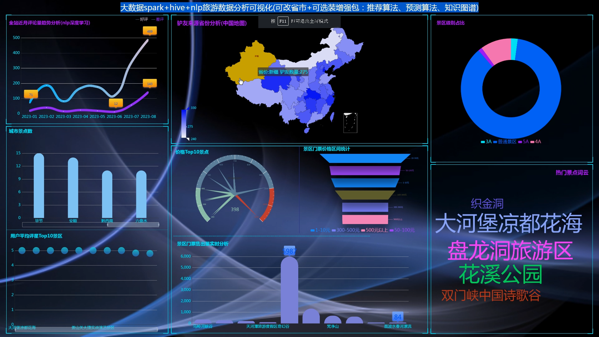
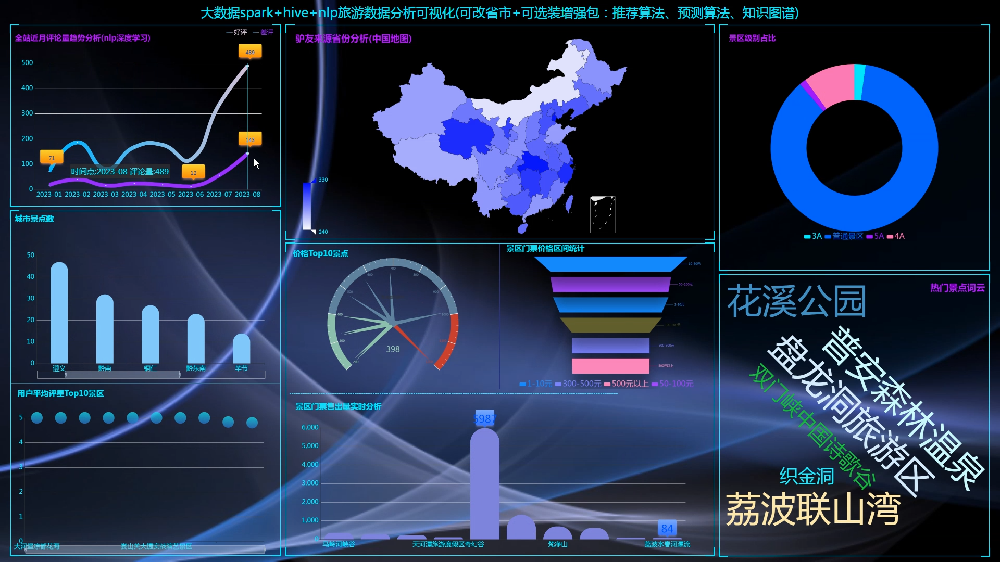
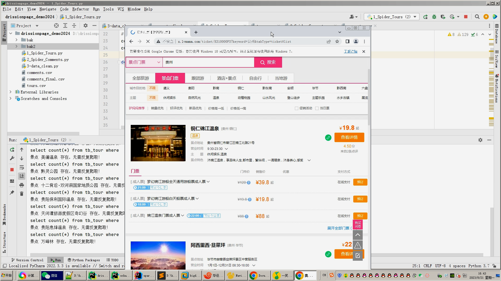
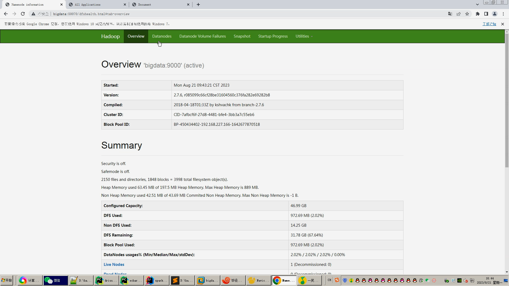
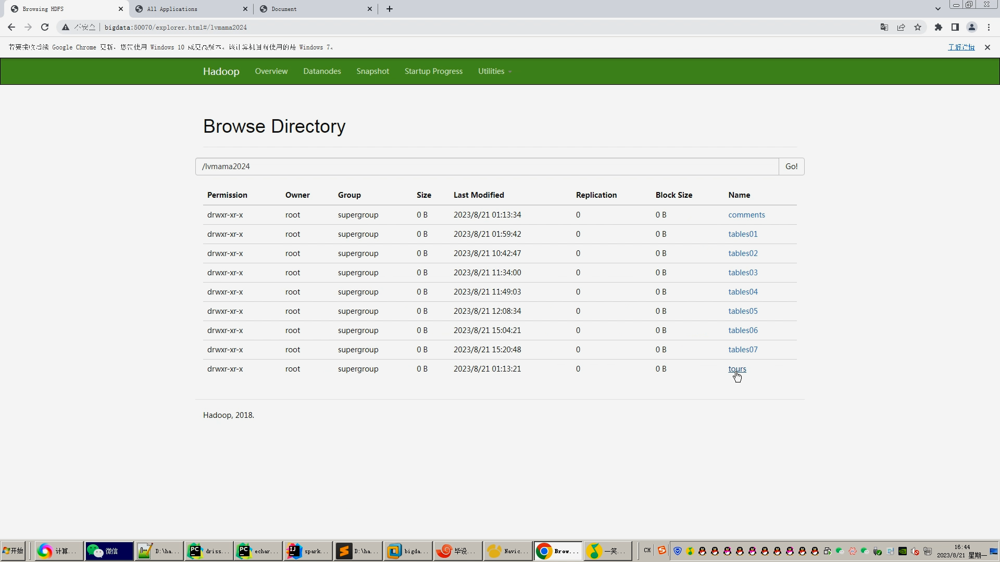
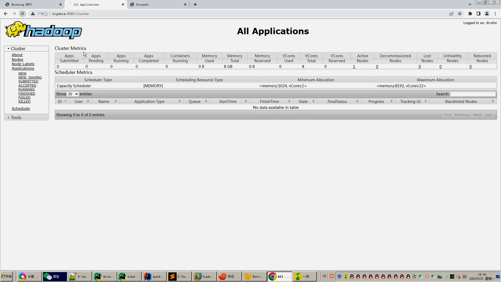
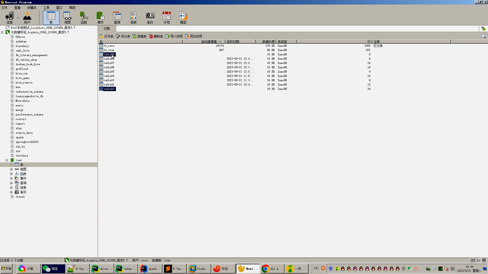
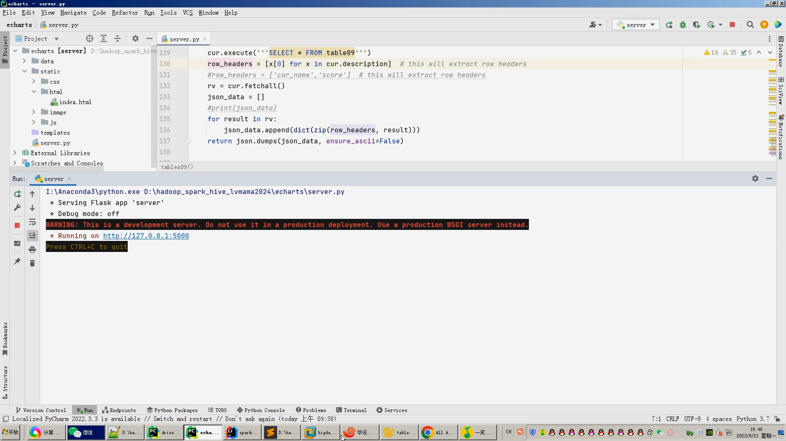
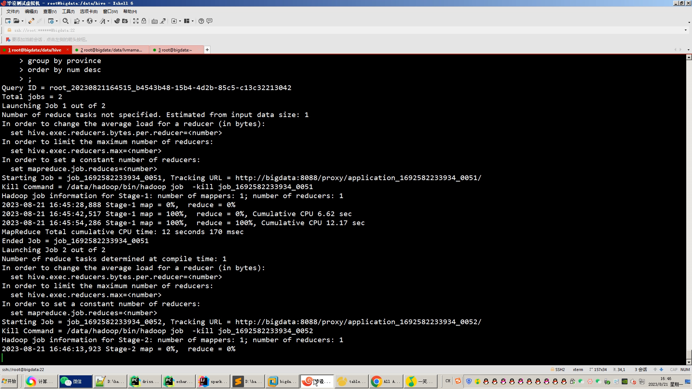

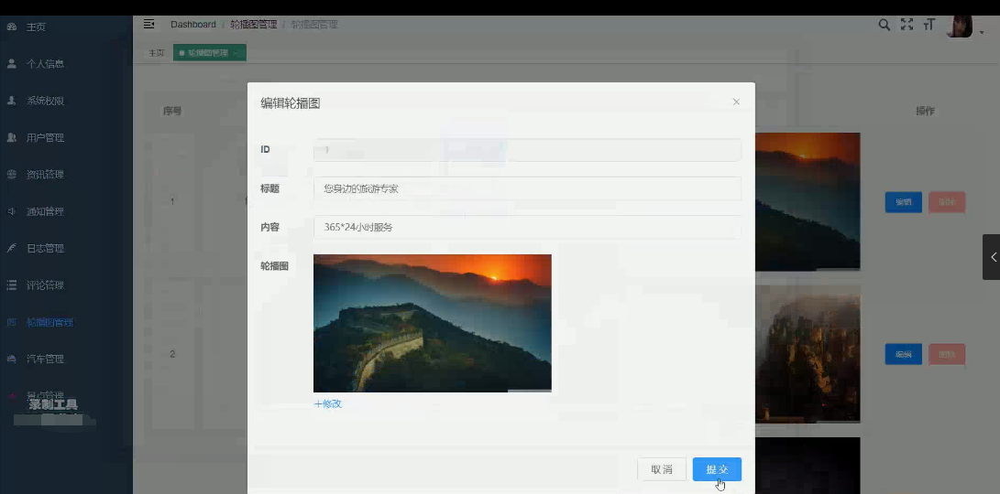
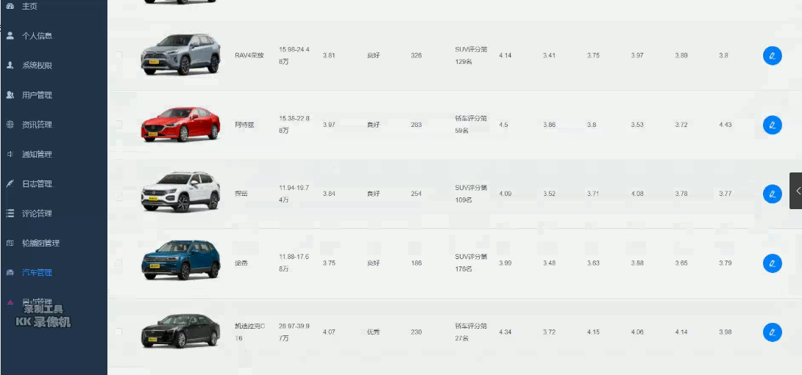
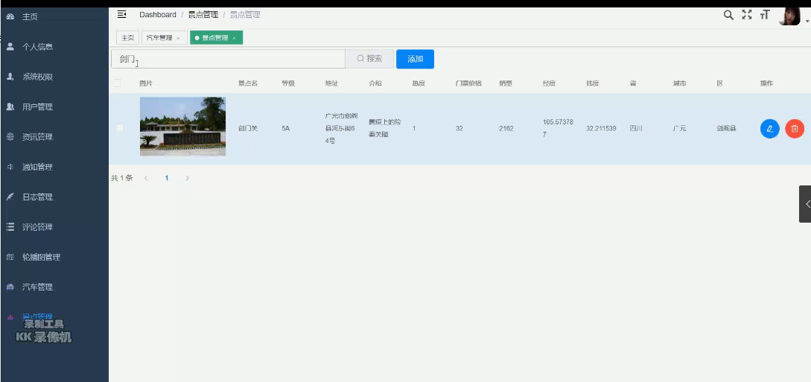
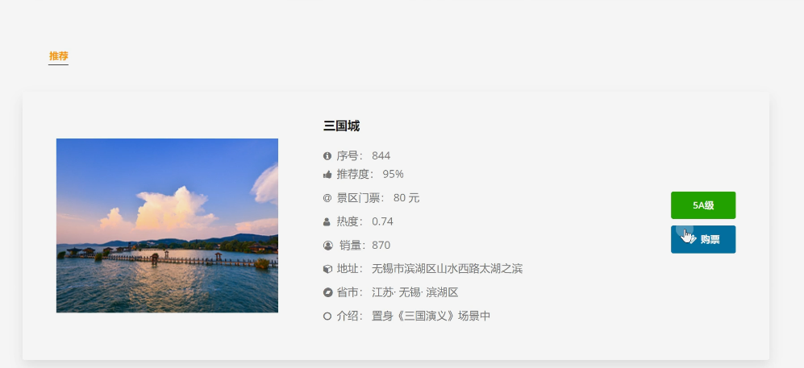

